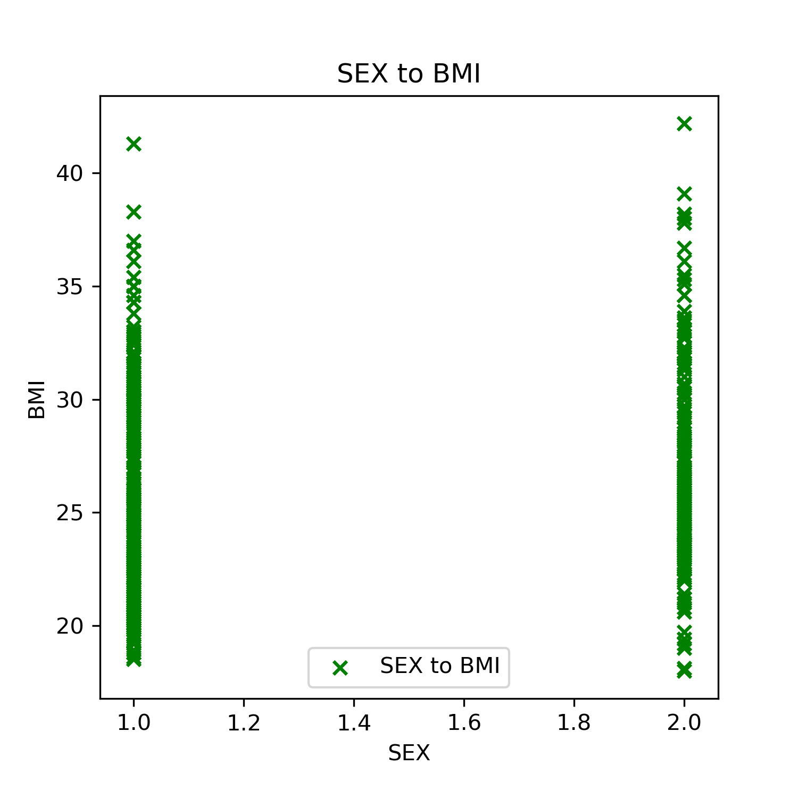
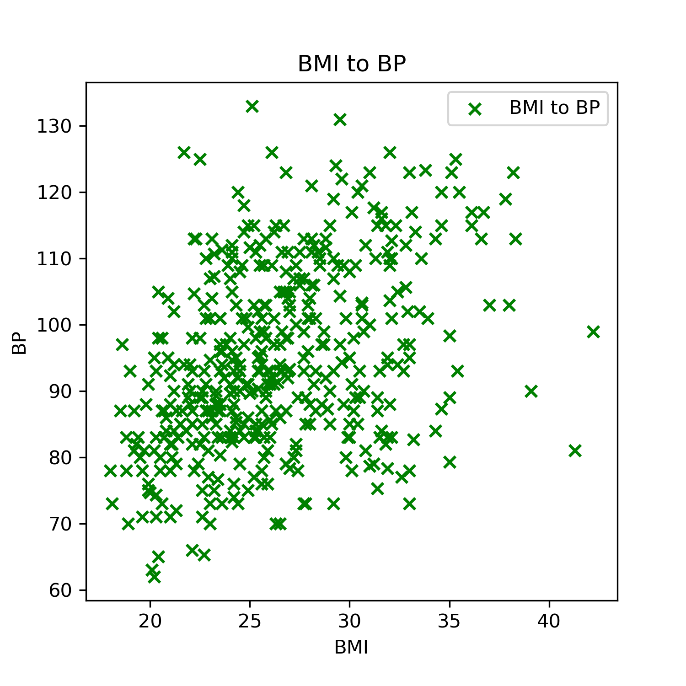
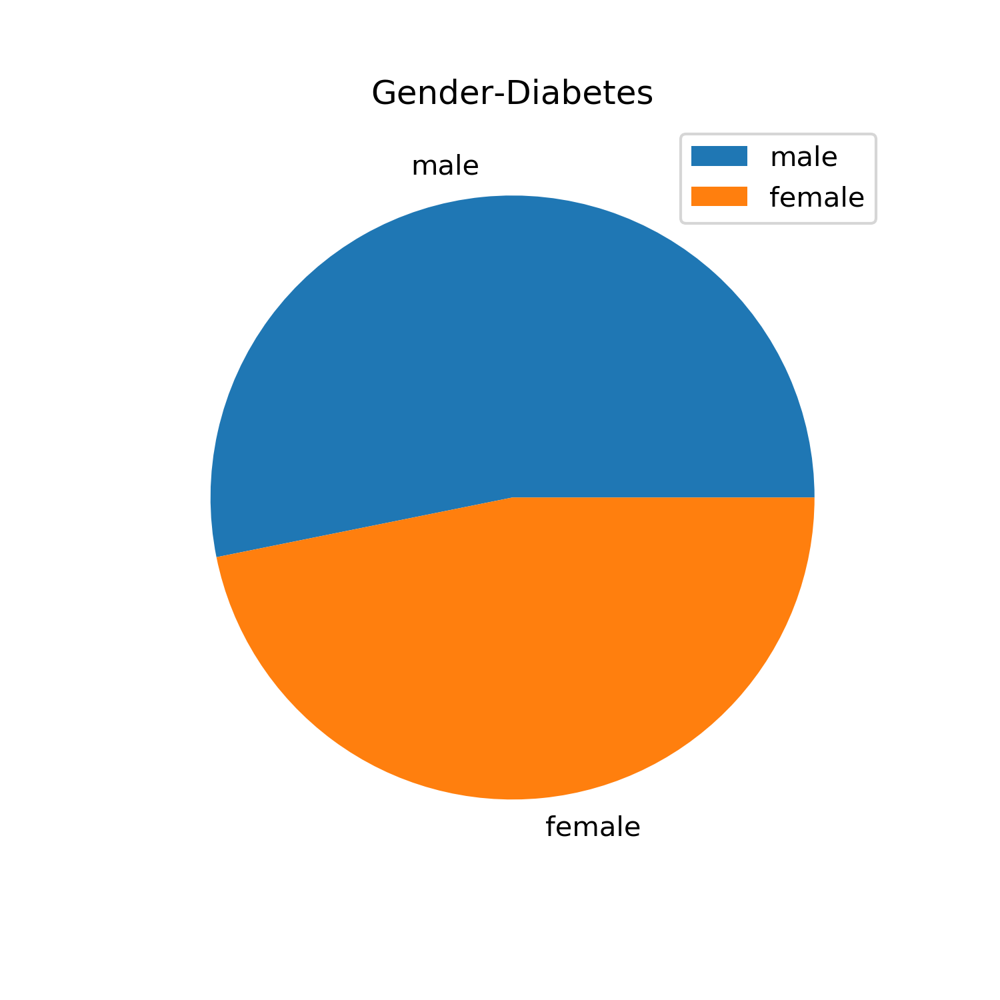
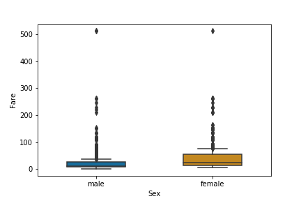

# Week 6 Assingment
<h2>Diabetes Data Analysis</h2>

The Diabetes can be analysed many factors. BMI(Body mass index) is one of the critcal factor to analyze Diabetes.
As BMI increases in male above normal weight level there are more chances the person have diabetes. Also, Higher BMI levels in male have higher chances of Diabetes then in female BMI.
Any increase in BMI above normal weight levels is associated with an increased risk of being diagnosed as having complications of diabetes

<h2> Blood Preasure </h2>
 The Blood presure is asscociated with diabetes. As we see bmi to bp scater graph. Body mass index (BMI) is positively associated with   blood pressure (BP).

As per the image above bmi is asscociated with the diabetes. And inscrease in BMI of a person chances of high blood presures too. The BMI and BP of a person plays vital role in diagnosis in diabetes. Body mass index (BMI) is the most widely used measure to define obesity and predict its complications, such as diabetes. High blood pressure, is a condition that’s seen in people with type 2 diabetes. There’s such a significant relationship between the two diseases.

Also major of Males have been diagnoised by diabetes then female.

<h2> Titanic Data</h2>
The output of box plots of train_titanic.csv. As we analyze the graph we can se there are many outliers in both male and female fares.

The Males have most of fares ranging from 10 - 30 and outliers go upto 500. Same is with female fares ranging from 20 to 60. the whisker of males show mostly towards fare costing 10 and whisker for female shows more towards 30. The over boxplots shows males average cost is low and females are more but the outliers mostly remains same for both of them. 

